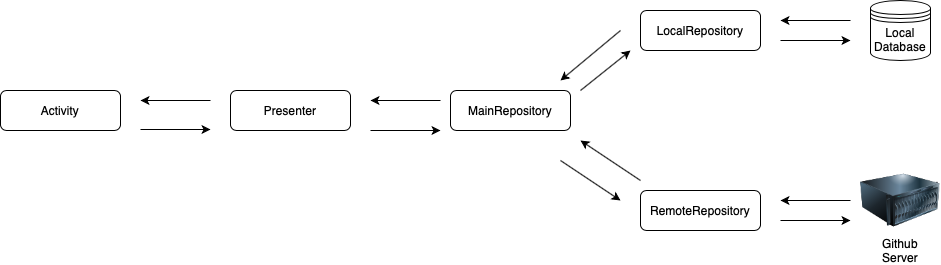

# Goal
Make an app that can fetch GitHub users list and then display the selected
user's profile.

# Features
- Show All Github users
- Viewing of User Profile
- Add/Edit a note to user
- Works offline

# Architectural pattern
<b>MVP</b> (Model, View, Presenter) is used to separate the business logic to view. This makes it easier to unit test.

# Top level flowchart

Roles
- Activity/Fragment - shows the UI screen
- Presenter - holds the business logic
- MainRepository - act as interactor for local and remote repository. Responsible requesting either for local database or remote server
- RemoteRepository - holds the github api operation
- LocalRepository - holds the local database operation

Steps
1. Activity/Fragment ask to presenter for list/profile.
2. Presenter request to MainRepository.
3. MainRepository call both local and remote repository.
4. A. Local Repository operates the local database and return the requested data to Main Repostory.  
B. Remote Repository operates the interaction on github server and return the requested data to MainRepository.
5. MainRepository received data and pass it back to presenter.
6. Presenter call the activity and show the data.

# Specifications
- Minimum Android version is <b>21</b> (Android 5.0 Lolipop)
- Maximum Android version is <b>30</b> (Android 11.0)
- <b>Github API</b> used as server (https://api.github.com/)
- Language used is <b>Kotlin</b>

# Dependencies
- [Kotlin Palette](https://developer.android.com/reference/kotlin/androidx/palette/graphics/Palette) - A helper class to extract prominent colors from an image.
- [Retrofit2](https://square.github.io/retrofit/) - A type-safe HTTP client for Android and Java
- [Retrofit Gson](https://github.com/square/retrofit/tree/master/retrofit-converters/gson) - A Converter which uses Gson for serialization to and from JSON.
- [Room](https://developer.android.com/training/data-storage/room) - provides an abstraction layer over SQLite to allow fluent database access while harnessing the full power of SQLite.
- [Coroutines](https://developer.android.com/kotlin/coroutines) - simplify code that executes asynchronously.
- [Glide](https://github.com/bumptech/glide) - An image loading and caching library for Android focused on smooth scrolling
- [Mockito](https://site.mockito.org) - Most popular Mocking framework for unit tests written in Java